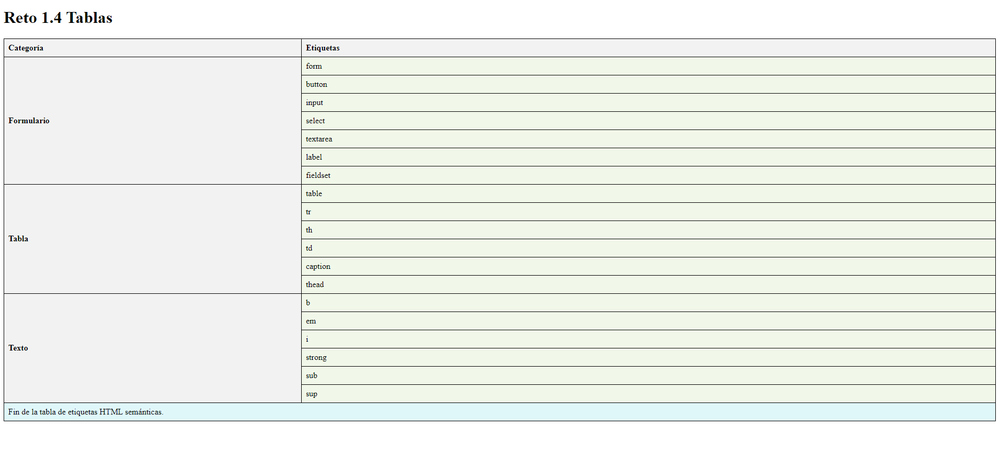

# Reto 1.4: Tabla
## Instrucciones:
Nombre y Apellidos: Pablo Rodríguez Crespo
URL del repositorio de gitlab: https://github.com/Pablosax9/ODAW2_RETO.1.4-Tabla.git

Partiendo del fichero html dado realiza:
Debes crear una página web que tenga el mismo aspecto que la siguiente imagen:

1. Añadele las etiquetas necesarias en el head.
2. Que se utilize la etiqueta caption.
3. Etiquetas semánticas para organizar partes de la tabla.
4. Uso de la etiqueta colgroup.
5. Añadele las etiquetas necesarias para su correcto funcionamiento.
